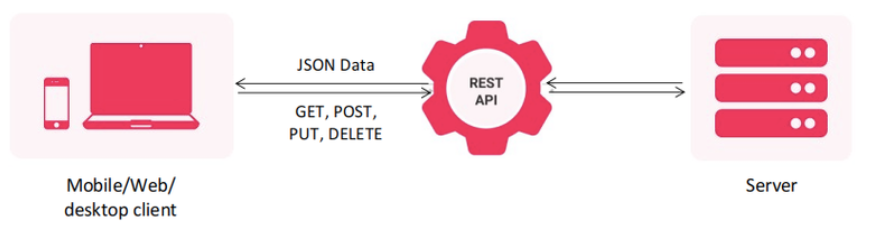
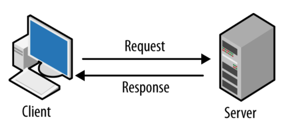

# (25) Introduction REST API - JSON serialization/deserialization

### NO. URUT : 1_017FLC_30

### NAMA : PRAYOGI DWI CAHYO PUTRO

## Summary

### **Rest API**
- Arsitektural yang memisahkan tampilan dengan proses bisnis
- Bagian tampilan dengan proses bisnis berkirim data melalui HTTP Request

### **HTTP**
Merupakan protokol yang digunakan untuk berkirim data pada internet, biasanya data tersebut berbentuk media web.

Pola Komunikasi : 
- Clint mengirim request
- Server mengolah dan membalas dengan memberi response

Struktur Request :
- URL, alamat halaman yang akan diakses
- Method (GET, POST, PUT, DELETE), menunjukan aksi yg diinginkan
- Header, informasi tamabahan terkait request yang dikirimkan
- Body, data yang disertakan bersama request

Struktur Response : 
- Status Code, kode yang mewakili keseluruhan response, baik sukses ataupun gagal
- Header, informasi tambahan terkait response yang diberikan
- Body, data yang disertakan bersama response

### **Dio**
- Dio sebagai HTTP Client
- Dio dimanfaatkan untuk melakukan REST API

Instalasi :
- Tambahkan dependencies pada pubspec.yaml
- Jalankan perintah **flutter pub get**

Penggunaan : 
untuk pengambilan data menggunakan Dio dapat menggunakan Dio().get()

### **Serialiasi JSON**
- Mengubah struktur data ke bentuk JSON
    >Map/List => Serialitasi => JSON

- Menggunakan fungsi **jsonEncode** dari package **dart:convert**

### **Deserialisasi JSON**
- Mengubah bentuk JSON ke struktur data
    >JSON => Deserialisasi => Map/List
- Menggunakan fungsi **jsonDecode** dari package **dart:convert**