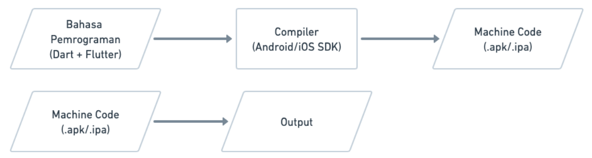

# (04) Introduction Mobile App Development
## Data Diri
### NO. URUT : 1_017FLC_30
### NAMA : PRAYOGI DWI CAHYO PUTRO
#
## Summary
### **Mobile Apps Development**

Mobile App Development merupakan suatu proses pengembangan aplikasi yang berjalan pada perangakat mobile, proses tersebut dimulai dari desain, pembuatan, testing sampai peluncuran pada aplikasi.

### **Software**

Software merupakan perangkat lunak yang tersimpan dan dapat dikendalikan pada sistem komputer. Perangkat lunak terbentuk dari perintah-perintah atau instruksi yang terorganisir agar software tersebut dapat berfungsi sesuai kemauan pembuatnya dan software tidak memiliki bentuk fisik.

#### Jenis-jenis Software :
- 
Web, dapat diakses melalui internet dengan menggunakan web browser. contoh : Google Chrome, Mozila Firefox, Microsoft Edge, dll.

- 
Desktop, merupakan software yang berjalan pada perangkat desktop maaupun Laptop. Contoh dari aplikasi Desktop adalah Microsoft Office, Adobe Photoshop dll

- 
Mobile, merupakan software yang berjalan pada perangkat smartphone atau tablet. Untuk mendapatkan aplikasi mobile bisa didapatkan melalui store penyedia aplikasi seperti Play Store untuk Android dan App Store untuk iOS. Aplikasi mobile dapat dibuka tanpa menggunakan internet dan ada juga aplikasi mobile yang dapat dibuka menggunakan internet untuk mendapatkan data dari server agar dapat bekerja sesuai dengan fungsinya.

### **Pengembangan Software**

Software merupakan kumpulan perintah yang terkumpul secara organisir. perintah tersebut dibuat oleh Software Developer menggunakan bahasa pemrograman. 

Bahasa Pemrograman adalah rangakaian teks yang digunakan untuk memberi perintah kepada komputer. Jumlah bahasa pemrograman yang ada sekarang lebih dari 300 bahasa, bahasa pemrograman yang populer contohnya : Pyhton, JavaScript, C++, C#, Ruby, Java, PHP dll.

Compiler adalah program yang digunakan untuk menerjemahkan source code menjadi bahasa mesin agar dapat dijalankan. Cara kerja Compiler adalah kumpulan printah yang sudah dibuat dengan bahasa pemrograman memerluhkan sebuah source code yang perlu dicompilasi agar dapat dimengerti oleh mesin. Setelah compiler dijalankan maka akan menghasilkan file .exe yang sudah dapat dieksekusi dan akan dikenali oleh mesin sesuai dengan perintah yang telah dibuat.

Interpreter adalah software yang digunakan untuk membaca perintah-perintah dalam bahasa pemrograman dan menjalankan langsung perintah-perintah tersebut. Cara kerja Interpreter dengan cara source code yang sudah dibuat akan diduplikat yang akan diterjemahkan oleh interpreter dan akan diterjemahkan secara baris perbaris dan menghasilkan output yang diinginkan.

### **Perbandingan Compiler dengan Interpreter**

Compailer
- Mengubah kode menjadi file yang dapat dijalankan
- Proses compailer lebih panjang, karena perlu melakukan compilasi terlebih dahulu
- Program yang dijalankan dengan compailer dapat dijalankan dengan cepat, karena tidak membaca ulang kode dan pemrogram tersebut sudah siap dieksekusi

Interpreter
- Membaca kode tanpa mengubah ke bentuk lain
- Proses lebih singkat
- Seringkali lebih lambat dikarenakan harus membaca ulang keseluruhan kode dan dijalankan baris perbaris

### **Mobile App Development**

Merupakan sebuah proses pengembangan aplikasi untuk perangkat mobile.
 

IOS, perangkat mobile ini berjalan pada sistem operasi iOS dan hanya dikembangkan oleh Apple. Bahasa pemrograman native dari iOS yaitu Swift dan Objective-C.

Android, perangkat mobile ini berhalan pada sistem operasi Android dan pengembangannya secara oper source. Bahasa pemrograman nativ dari Android yaitu Kotlin dan Java.

Bahasa pemrograman Dart dapat digunakan untuk pengembangan aplikasi iOS maupun Android dengan Single Code Base. 

### **Tahapan Pemrograman Aplikasi Mobile**

